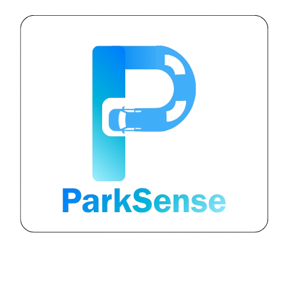

<!-- Improved compatibility of back to top link -->
<a id="readme-top"></a>

<!-- PROJECT SHIELDS -->
[![Contributors][contributors-shield]][contributors-url]
[![Forks][forks-shield]][forks-url]
[![Stargazers][stars-shield]][stars-url]
[![Issues][issues-shield]][issues-url]
[![License][license-shield]][license-url]

<!-- PROJECT LOGO -->
<br />
<div align="center">
  <a href="https://github.com/wuqin04/ParkSense">
    
  </a>

  <h3 align="center">ParkSense</h3>

  <p align="center">
    A simple yet powerful desktop tool to help you organize, clean, and manage your files efficiently.
    <br />
    <br />
    ·
    <a href="https://github.com/wuqin04/ParkSense/issues/new?labels=bug&template=bug-report---.md">Report Bug</a>
    ·
    <a href="https://github.com/wuqin04/ParkSense/issues/new?labels=enhancement&template=feature-request---.md">Request Feature</a>
  </p>
</div>

---

## 📖 About The Project

![Website Screenshot][website-screenshot]

**ParkSense** is a desktop application that helps users quickly organize files and remove duplicates with ease.  
It was designed with **students, professionals, and daily PC users** in mind — anyone who wants a cleaner workspace without complex setup.

### ✨ Features
- 📁 **File Organizer** – Automatically group and sort files by type, date, or custom rules.  
- 🔍 **Duplicate Scanner** – Detect and remove duplicate files safely.  
- 🌙 **Dark/Light Themes** – Choose your preferred appearance mode.  
- ⚙️ **Custom Configuration** – Save your preferences for future use.  
- 🚀 **Lightweight** – Fast performance with a minimal interface.

<p align="right">(<a href="#readme-top">back to top</a>)</p>

---

## 🛠️ Built With

* [![Python][Python-badge]][Python-url]
* [![MicroPython][MicroPython-badge]][MicroPython-url]
* [![JavaScript][JavaScript-badge]][JavaScript-url]
* [![HTML][HTML-badge]][HTML-url]
* [![CSS][CSS-badge]][CSS-url]

<p align="right">(<a href="#readme-top">back to top</a>)</p>

---

## 🚀 Getting Started

Follow these steps to set up **ParkSense** locally.

### 📋 Prerequisites

- Python 3.13 or newer
- pip package manager  

To check your version:
```sh
python --version
pip --version
```

### ⚙️ Installation

#### Option 1 — From Source
1. **Clone the repository**
   ```bash
   git clone https://github.com/wuqin04/ParkSense.git
   cd ParkSense
   ```

2. **Install dependencies**
   ```bash
   pip install -r requirements.txt
   ```

3. **Run the application**
   ```bash
   python main.py
   ```

#### Option 2 — From Release (Recommended for Most Users)
1. Go to the **[Releases page](https://github.com/wuqin04/ParkSense/releases)**.  
2. Download the latest version of **ParkSense** for your operating system (e.g. `ParkSense_v1.0.0.exe`).  
3. Run the installer or executable — no setup required.  

> 💡 Ideal for students or non-technical users who just want to use ParkSense right away.

<p align="right">(<a href="#readme-top">back to top</a>)</p>

---

## 💡 Usage

Once launched, you can:
- Select a folder to organize or scan.
- Use the **Organizer tab** to sort files by type or date.
- Use the **Duplicate Scanner** to detect and delete duplicate files.
- View all logs and results directly inside the app.

> 💡 **Tip:** Customize appearance and behavior from the config menu.

<p align="right">(<a href="#readme-top">back to top</a>)</p>

---

## 🗺️ Roadmap

- [x] File Organizer  
- [x] Duplicate Scanner  
- [ ] Pro Features (Batch Cleanup, Smart Sort)  
- [ ] Cloud Sync  
- [ ] Multi-language Support  

See the [open issues](https://github.com/wuqin04/ParkSense/issues) for all proposed features and known issues.

<p align="right">(<a href="#readme-top">back to top</a>)</p>

---

## 🤝 Contributing

Contributions make the open-source community amazing!  
If you’d like to contribute:

1. Fork the project  
2. Create your Feature Branch (`git checkout -b feature/NewFeature`)  
3. Commit your changes (`git commit -m 'Add new feature'`)  
4. Push to your branch (`git push origin feature/NewFeature`)  
5. Open a Pull Request  

⭐ Don’t forget to **star** the project if you like it!

<a href="https://github.com/wuqin04/ParkSense/graphs/contributors">
  
</a>

<p align="right">(<a href="#readme-top">back to top</a>)</p>

---

## 📄 License

Distributed under the **Apache License 2.0**. See the [`LICENSE`](LICENSE) file for more details.

<p align="right">(<a href="#readme-top">back to top</a>)</p>

---

## 📬 Contact

**Jimmy Wu**  
📧 wuqin419@gmail.com  
🔗 [Project Link](https://github.com/wuqin04/ParkSense)

<p align="right">(<a href="#readme-top">back to top</a>)</p>

---

## 🙏 Acknowledgments

Special thanks to:
* [Python.org](https://www.python.org/)
* [FadeAlpha](https://github.com/Fadealpha)
* [Ming](https://github.com/minglau1)
* [YiMing](http://instagram.com/yimingminyig/)
* [Calvin](https://www.instagram.com/calvin_.05/)

<p align="right">(<a href="#readme-top">back to top</a>)</p>

<!-- MARKDOWN LINKS & IMAGES -->
[contributors-shield]: https://img.shields.io/github/contributors/wuqin04/ParkSense.svg?style=for-the-badge
[contributors-url]: https://github.com/wuqin04/ParkSense/graphs/contributors
[forks-shield]: https://img.shields.io/github/forks/wuqin04/ParkSense.svg?style=for-the-badge
[forks-url]: https://github.com/wuqin04/ParkSense/network/members
[stars-shield]: https://img.shields.io/github/stars/wuqin04/ParkSense.svg?style=for-the-badge
[stars-url]: https://github.com/wuqin04/ParkSense/stargazers
[issues-shield]: https://img.shields.io/github/issues/wuqin04/ParkSense.svg?style=for-the-badge
[issues-url]: https://github.com/wuqin04/ParkSense/issues
[license-shield]: https://img.shields.io/badge/License-Apache_2.0-blue.svg?style=for-the-badge
[license-url]: https://www.apache.org/licenses/LICENSE-2.0
[website-screenshot]: assets/website.png
[product-image]: assets/product.png
[award-photo]: assets/award.png
[Python-badge]: https://img.shields.io/badge/Python-3776AB?style=for-the-badge&logo=python&logoColor=white
[Python-url]: https://www.python.org/
[MicroPython-badge]: https://img.shields.io/badge/MicroPython-3776AB?style=for-the-badge&logo=python&logoColor=white
[MicroPython-url]: https://www.micropython.org/
[JavaScript-badge]: https://img.shields.io/badge/JavaScript-3776AB?style=for-the-badge&logo=javascript&logoColor=white
[JavaScript-url]:https://www.javascript.com/
[HTML-badge]:https://img.shields.io/badge/HTML-3776AB?style=for-the-badge&logo=html5&logoColor=white
[HTLM-url]: https://html.com/
[CSS-badge]: https://img.shields.io/badge/CSS-3776AB?style=for-the-badge&logo=css&logoColor=white
[CSS-url]: https://web.dev/css